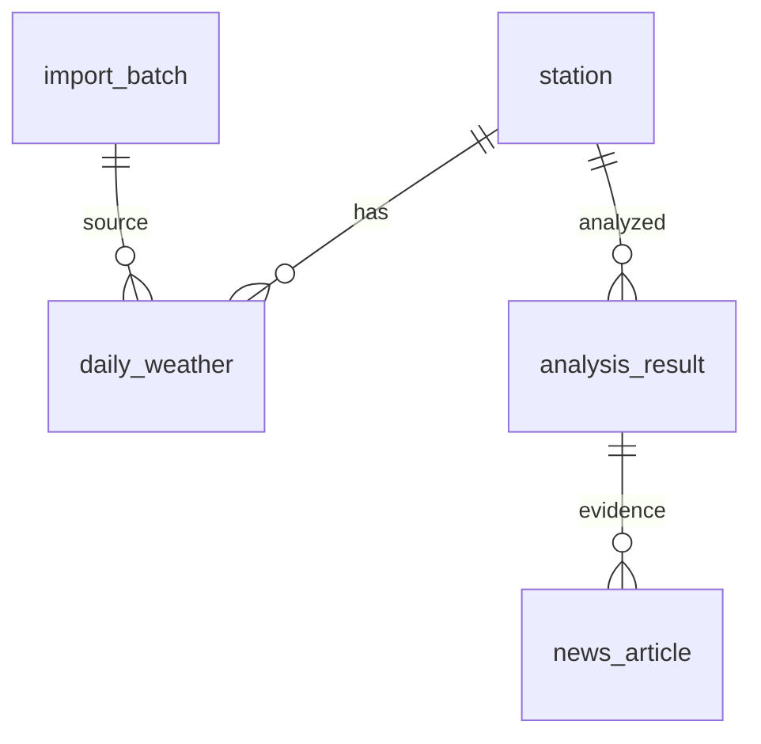

# 실제 과거 관측 CSV → MySQL → 비교 → 사람이 기사 작성

기존 OpenWeather 순간 관측 앱과 분리된 실습입니다. 실제 기상청 CSV를 사용자가 내려받아 넣습니다. 가상 관측값이나 기사를 포함하지 않습니다. 예보·특보·공휴일·AI 호출은 이번 버전에 포함하지 않습니다.

## CSV 확보

공식 출처: https://data.kma.go.kr/data/grnd/selectAsosRltmList.do?pgmNo=36

페이지 텍스트에서 ASOS 일자료, 기간·지점·요소 조회와 CSV/Excel 제공, 로그인 안내를 확인했습니다(2026-10-07). 실제 화면 배치와 다운로드 동작은 확인하지 않았습니다. 아래는 선택 조건이며 버튼 위치 안내가 아닙니다.

1. 기상자료개방포털에 접속하고, 요구되면 회원가입/로그인합니다.
2. 데이터 → 기상관측 → 지상 → 종관기상관측(ASOS) 자료 조회를 사용합니다.
3. 자료형태 **일**, 지점 **서울**, 요소 **평균기온**을 선택합니다. 시간 자료나 월 통계와 혼동하지 않습니다.
4. **2025-09-01~2025-09-30**을 조회하고 CSV로 내려받습니다.
5. 파일을 `data/raw/seoul_2025_09.csv`로 보관합니다.
6. 같은 조건에서 **2026-09-01~2026-09-30**을 내려받아 `data/raw/seoul_2026_09.csv`로 보관합니다.
7. 올해 자료가 없거나 불완전하면 완전한 자료가 있는 다른 두 해의 같은 달을 선택합니다. 없는 값을 만들지 않습니다.

아래 실행 예시는 서울의 CSV 지점 코드가 108인 경우입니다. 원본 지점 코드가 다르면 --station 값을 바꿉니다. 직접 다운로드 인증이나 실제 파일 확보는 수행하지 않아 실제 CSV는 동봉하지 않습니다.

| CSV 열 | 저장할 DB 열 |
|---|---|
| 지점 | station_id |
| 지점명 | station_name |
| 일시 (YYYY-MM-DD) | observed_date |
| 평균기온(℃) | avg_temp_c |

영문 헤더 station_id,station_name,observed_date,avg_temp_c도 지원합니다. °C 표기와 열 이름 공백을 처리하며 추가 열은 무시합니다. 실제 내려받은 CSV에서 필수 열을 확인하세요.
UTF-8 BOM/CP949를 자동 시도합니다. 원본은 그대로 보관하세요. 빈 기온은 NULL입니다. -999 같은 값은 오류로 중단합니다. 원본 설명에서 결측 부호를 확인하고 정제할 때는 별도 파일로 저장하세요.

## 설치: Windows PowerShell

MySQL 8.0.16 이상(CHECK 적용), Workbench, Python 3.10 이상. 프로젝트 폴더에서 실행합니다.

```powershell
py -m venv .venv
.venv\Scripts\python.exe -m pip install -r requirements.txt
Copy-Item .env.example .env
```

.env의 MYSQL_PASSWORD를 본인 MySQL 비밀번호로 수정합니다. 비밀번호를 GitHub에 올리지 않습니다. Workbench에서 schema.sql 전체를 실행합니다. 기존 테이블을 삭제하지 않고 weather_history_lab DB를 생성합니다.

## CSV 검사와 저장

먼저 DB 연결 없이 검사합니다.

```powershell
.venv\Scripts\python.exe weather_lab.py import-csv data/raw/seoul_2025_09.csv --validate-only
.venv\Scripts\python.exe weather_lab.py import-csv data/raw/seoul_2026_09.csv --validate-only
```

검사 통과 후 저장합니다.

```powershell
.venv\Scripts\python.exe weather_lab.py import-csv data/raw/seoul_2025_09.csv
.venv\Scripts\python.exe weather_lab.py import-csv data/raw/seoul_2026_09.csv
```

같은 파일 해시는 재저장을 생략합니다. 다른 파일에 이미 저장된 동일 관측소·날짜·기온이 있으면 그 행을 생략합니다. 기존 날짜의 기온과 다르면 자동 덮어쓰기하지 않고 전체 파일 저장을 취소합니다. 정정 자료 여부를 확인한 뒤 별도 수정 정책이 필요합니다. 한 파일은 한 트랜잭션이며 오류 시 rollback합니다. 파일명·SHA256·출처·수집 시각을 보존합니다.
기온 범위 검사는 입력 실수를 찾는 교육용 검사이며 기상청 품질 판정을 대신하지 않습니다.

## SQL 조회와 Python 비교

Workbench에서 queries.sql을 실행합니다. 관측소·연도·월 변수를 본인 자료에 맞게 바꾸세요. 관측소/관측/출처 JOIN, 유효 날짜 수, 두 기간 평균 차이, 기사 근거 JOIN을 확인할 수 있습니다.

```powershell
.venv\Scripts\python.exe weather_lab.py compare --station 108 --baseline-year 2025 --target-year 2026 --month 9
```

DB analysis_result와 data/results/fact_sheet.json에 저장하며 analysis_id가 출력됩니다.
산식: 해당 월 일평균기온의 합 / 전체 일수. 차이 = 대상 해 평균 - 기준 해 평균. 반올림 전 평균의 차이를 계산한 뒤 소수 둘째 자리로 표시합니다. 표시된 평균끼리의 차이는 반올림 때문에 0.01℃ 다를 수 있습니다.
**두 달 모두 모든 날짜의 기온이 있어야 결과를 저장합니다.** 빠진 날짜나 NULL 기온이 있으면 중단합니다. 교육용 엄격 정책이며 기상청 공식 결측 보정/월평균 산출 절차의 구현은 아닙니다. 공식 월 통계와 산출 방식에 따라 차이가 있을 수 있습니다.
두 기간만으로 장기 기후변화, 통계적 유의성, 변화 원인을 단정하지 않습니다. 장기간 비교는 관측소 이전/장비 변경도 검토해야 합니다.

## 사람이 작성한 기사 저장

근거 JSON을 보고 제목·리드·본문을 작성합니다. 지역·두 기간·평균·차이·출처를 대조합니다. 본문을 UTF-8 파일 data/results/article.txt에 저장합니다.

```powershell
# 1 대신 compare가 출력한 실제 analysis_id를 입력합니다.
.venv\Scripts\python.exe weather_lab.py save-article --analysis-id 1 --title "직접 작성한 기사 제목" --lead "직접 작성한 리드" --body data/results/article.txt
```

HUMAN/DRAFT로 저장합니다. DRAFT는 사실 검증 통과를 의미하지 않습니다. 다음 주 AI 연결 때 같은 fact_sheet를 전달하고 같은 analysis_id에 AI 기사를 연결해 비교할 수 있습니다. 이 버전에 AI 호출은 없습니다.

## ERD와 제약조건



- PK: 관측소·가져오기·관측값·분석·기사 식별.
- FK: 존재하는 부모만 연결.
- UNIQUE: 관측소+날짜, 파일 해시 중복 방지.
- CHECK: 월 범위·서로 다른 연도·제목/본문·기사 작성자 구분·상태 검사.
- ON DELETE RESTRICT: 기사 근거 연결이 있는 부모의 삭제 금지. RESTRICTED는 SQL 키워드가 아닙니다.
- CASCADE/SET NULL은 기사 근거 삭제/단절을 방지하기 위해 선택하지 않았습니다.
- 분석 JSON에 당시 계산 결과와 원본 파일 해시·출처를 보존합니다.

## 검증과 한계

```powershell
.venv\Scripts\python.exe -m unittest discover -s tests -v
```

7개 단위 테스트: CP949/NULL, 중복, 비정상 기온, 시간 자료 거부, 열 누락, 완전한 달 평균, 불완전한 달 중단. 테스트에서만 쓰는 가상 값은 실습 원본이 아닙니다.
개발 환경에 MySQL 서버가 없어 실제 DDL/트랜잭션 실행은 검증하지 않았습니다. 실물 기상청 CSV도 가져오지 않았습니다. 사용자 환경에서 아래를 확인하세요.

1. DDL 실행 후 5개 테이블 확인.
2. 원본 CSV 2개 검사·저장 후 유효 일수 확인.
3. 동일 파일 재가져오기 시 행 수가 증가하지 않는지 확인.
4. queries.sql과 fact_sheet.json의 평균·차이 비교.
5. 기사 저장 후 기사/분석/관측소 JOIN 확인.

## 수업 결과물

출처 링크 + 원본 CSV 2개 + 필드 설명 + ERD + DDL + SQL 비교 결과 + fact_sheet.json + 사람이 쓴 기사.
원본 공개 시 출처의 이용 조건을 확인하세요.
